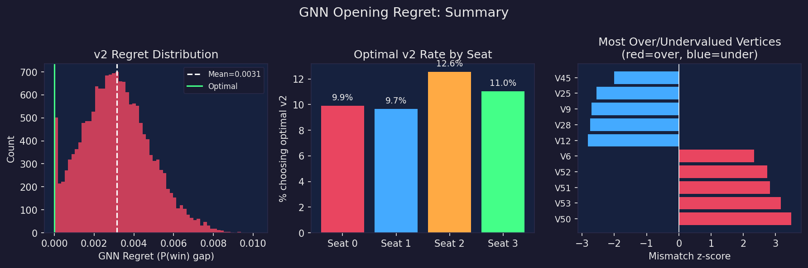
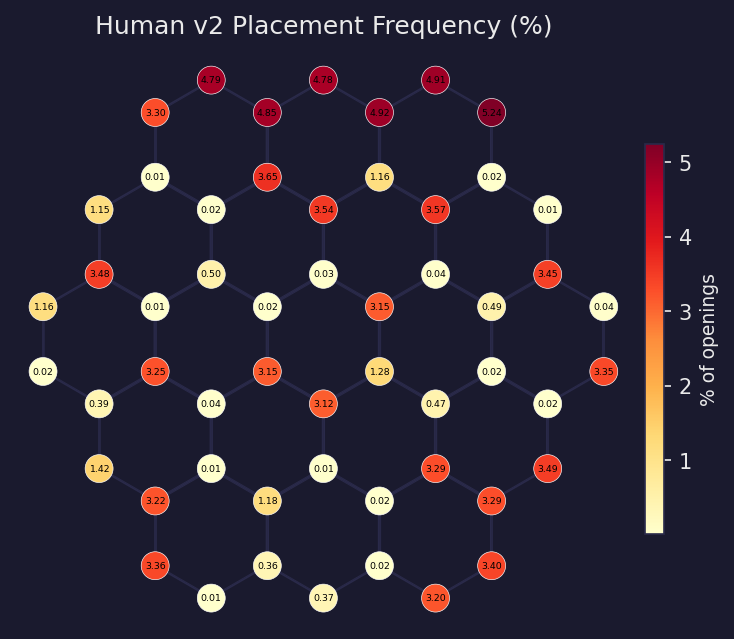
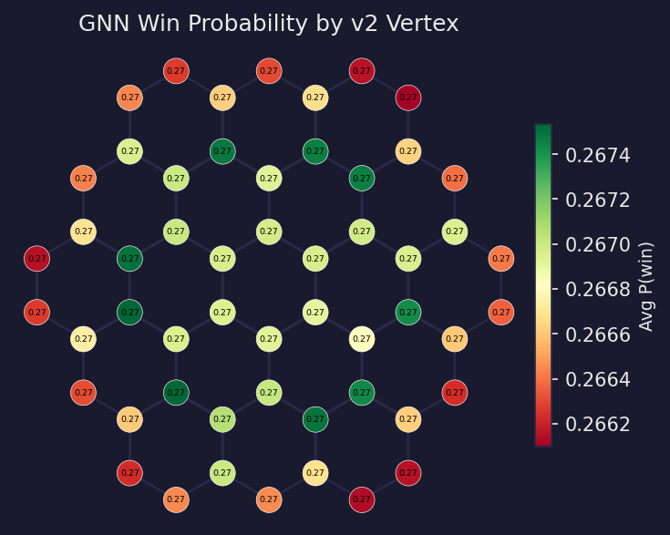
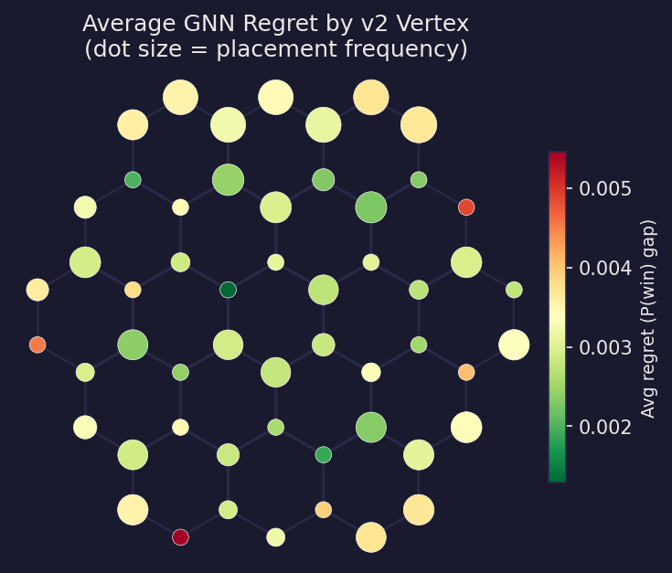
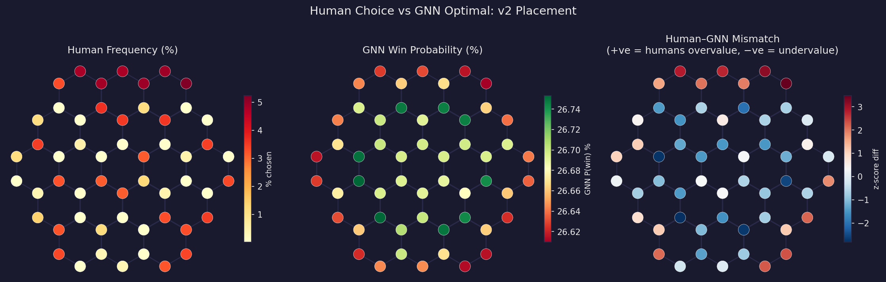

## Background

In Catan, each player places two settlements before the game starts. **v1** is the first settlement; **v2** is the second. Seat order follows a snake draft: seats 0-1-2-3 place v1 in order, then 3-2-1-0 place v2. Seat 0 picks first but places v2 last; seat 3 picks back-to-back in the middle.

We ask: given where a player placed v1, how suboptimal was their v2 choice?

---

## Model

We trained a **StaticBoardGCN** (a graph convolutional network) on 135,835 labelled openings from 43,947 real games. Unlike prior models that use hand-crafted features, the GNN sees the raw board graph: which vertices neighbour which hexes.

| Model | Test AUC |
|-------|----------|
| Pip count heuristic | 0.503 |
| Logistic regression | 0.508 |
| Gradient boosting | 0.510 |
| **StaticBoardGCN (GNN)** | **0.510** |

All models are close to 0.5. Win probability from a single opening in a 4-player game is genuinely hard to predict. The GNN's incremental gain confirms that spatial board structure carries a small but real signal.

---

## Method

For each of the **16,978 test-set openings**:

1. Fix the human's v1 placement.
2. Score all 54 possible v2 placements with the GNN.
3. Compute regret = best available score - actual score.

This gives **GNN-conditional v2 regret**: how much win probability did the human sacrifice in their second placement?

---

## Findings

### 1. Humans leave ~0.3pp on the table in the second placement

| Metric | Value |
|--------|-------|
| Mean GNN v2 regret | **0.0031** |
| 25th / 75th percentile | 0.0019 / 0.0042 |
| % choosing optimal v2 | **10.8%** |

The distribution is right-skewed: most players are close to optimal, but roughly 15% make choices the GNN considers substantially worse.

\FloatBarrier

### 2. Human placement frequency shows clear hot spots

Interior vertices (adjacent to 3 hexes, higher pip counts) attract far more v2 placements than rim vertices, regardless of the specific board.

{ width=70% }

### 3. The GNN's vertex preferences are narrow but consistent

The GNN's average win probability by v2 vertex spans only **0.2662-0.2674** (~0.12pp). This reflects Catan's balance: no single vertex is dramatically dominant. But the spread is real and consistent with the non-random AUC.

{ width=70% }

### 4. Regret is spatially structured

Dot size represents how often humans choose each vertex; colour represents average regret. High-frequency rim vertices tend to carry higher regret: humans choose them often, but the GNN rates them relatively poorly compared to interior vertices.

{ width=70% }

\FloatBarrier

### 5. Human-GNN mismatch: overvalued ports, undervalued interior

The three panels below show human frequency, GNN value, and the standardised mismatch (positive = humans overvalue, negative = humans undervalue).

- **Overvalued by humans:** port-adjacent rim vertices. Visually salient due to port icons, but the GNN discounts them in v2 because they narrow your production profile.
- **Undervalued by humans:** interior vertices adjacent to 3 hexes. Less obvious visually, but higher expected pip count and better expansion potential.

\FloatBarrier

### 6. Seat effects are modest

| Seat | % choosing optimal v2 |
|------|------------------------|
| 0 | 9.9% |
| 1 | 9.7% |
| 2 | 11.0% |
| 3 | 12.6% |

Later seats choose the GNN-optimal v2 slightly more often, likely because a constrained choice space incidentally aligns with GNN rankings.

---

## Interpretation

Human v2 choices diverge from the GNN-optimal in a spatially consistent way: port-adjacent and visually prominent rim spots are systematically overvalued; interior high-production vertices are undervalued.

The magnitude is modest (0.3pp mean regret) and the opening is not the primary driver of Catan outcomes. But the pattern is meaningful: it reflects a bias toward salient features (ports, isolated spots) over raw production and expansion potential.

The GNN's 0.510 AUC confirms that even with full board topology, the signal from a single opening is weak. The value of this model is less in prediction and more in diagnosis: it provides a topology-aware baseline for what an optimal player would do, against which human biases can be measured.
