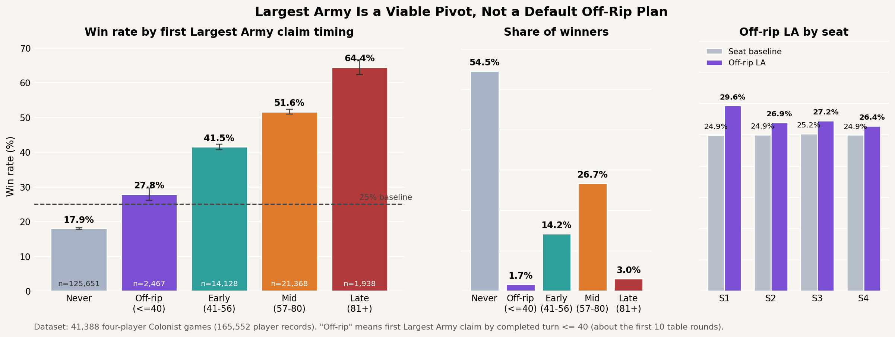

# Is Largest Army A Viable Strat To Go For Off Rip?

Short answer: not as a default plan.

Largest Army is a real win condition, but the data says it is much better as a midgame pivot than as something you should force from turn 1.

## Verdict

- If "off rip" means claiming Largest Army by completed turn `<= 40` (about the first 10 table rounds), the win rate is `27.8%` on `2,467` player-samples.
- The baseline win rate in a four-player game is `25.0%`.
- That is only a `+2.9` percentage-point lift, which is real but small.
- Only `1.7%` of all winners claimed Largest Army that early.
- `54.5%` of winners never claimed Largest Army at all.

The important pattern is timing:

- Off-rip claim (`<= 40`): `27.8%` win rate
- Early claim (`41-56`): `41.5%`
- Mid claim (`57-80`): `51.6%`
- Late claim (`81+`): `64.4%`

That shape strongly suggests Largest Army is usually a conversion tool for already-good positions, not a strong opening identity by itself.

## Interpretation

- Forcing early dev-card tempo just to race Largest Army does not look dominant.
- If the board and hand naturally hand you knight pressure, Largest Army is a strong branch to take.
- If you have to distort your opening economy to chase it immediately, the payoff is modest.
- No seat shows a huge off-rip Largest Army edge; the early-claim bump is only mild across all four seats.

## Figure



## Data and method

- Source: `games.tar.gz` in the repo root
- Sample: `41,388` four-player Colonist games, `165,552` player records
- Largest Army claim timing is inferred from live event-log entries with `achievementEnum == 1`
- "Off-rip" is defined as first Largest Army claim by completed turn `<= 40`

## Reproduce

```bash
python research/largest_army_opening/analyze.py
```

If `summary.json` already exists and you just want to redraw the figure:

```bash
python research/largest_army_opening/analyze.py --from-summary
```
