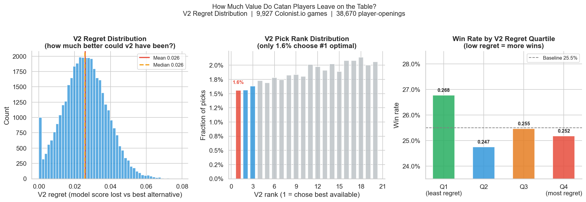
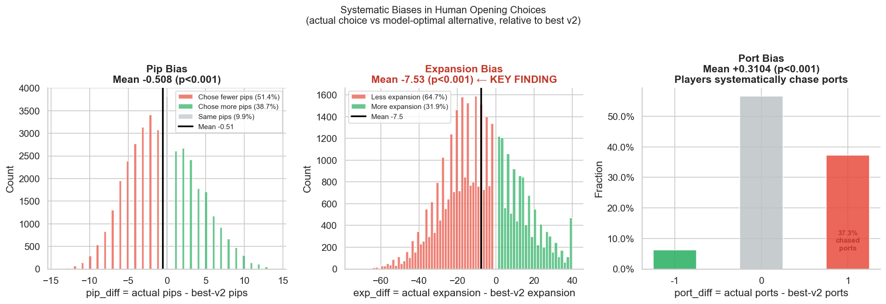
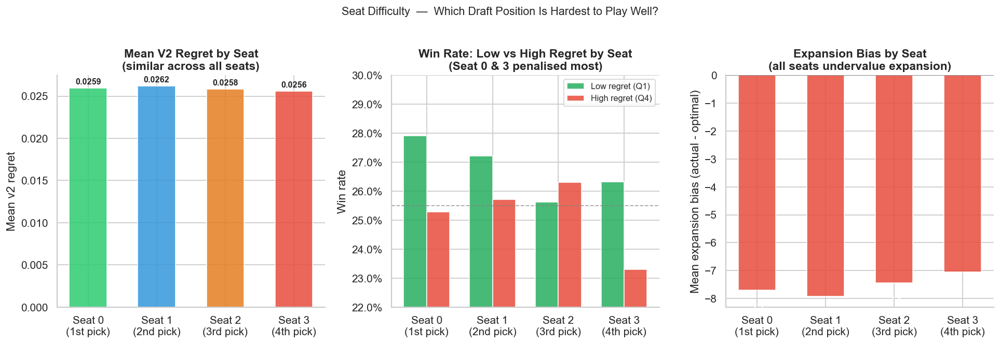
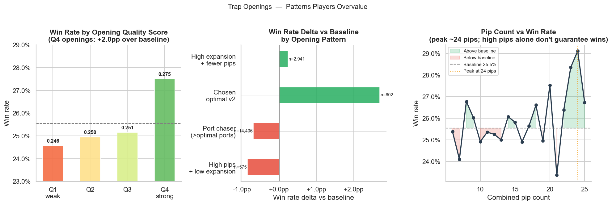
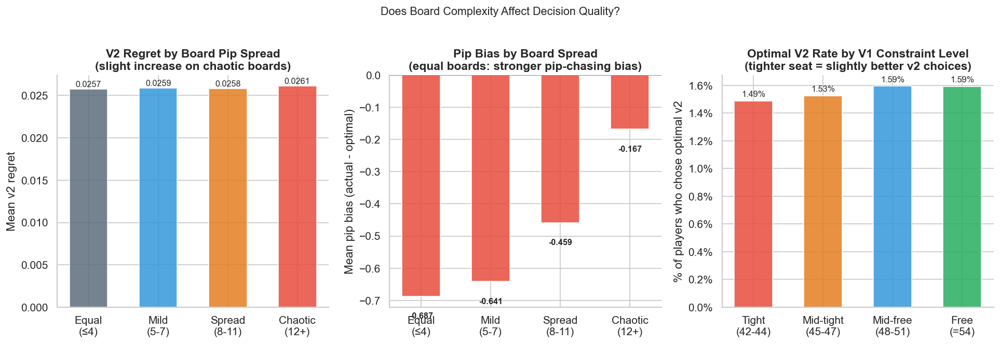
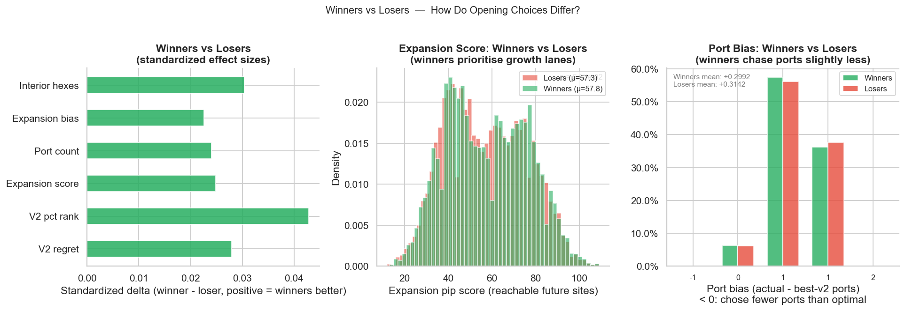
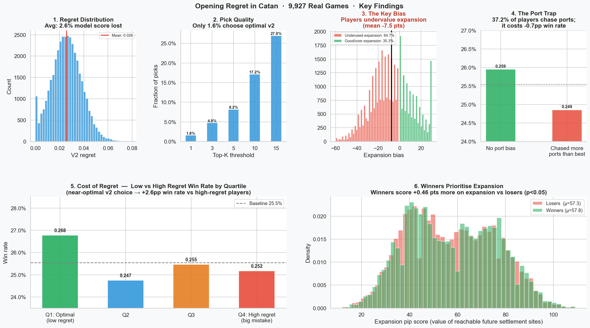

# Opening Regret in Catan
### How well do human players choose opening settlements, and what systematic biases explain the gap?

**Dataset**: 9,927 Colonist.io games · 38,670 player-openings · 4-player games

---

## The Question

Most Catan analysis stops at "which opening is strongest?" This project asks something harder:

> Given the board, the seat, and all legal options available to a player — how often do they find the best opening, and what kinds of mistakes do they consistently make?

This turns the project from a board evaluator into a **human decision quality** study. The answer isn't just "players are suboptimal." It's that players have specific, measurable, directional biases that reveal *how* they reason about the opening.

---

## Methodology

For each game:
1. The board is reconstructed from the real game record (tile types, numbers, port positions)
2. For each player's **actual first settlement (v1)**, all legal second-settlement (v2) alternatives are enumerated given the occupied state at pick time
3. Each alternative is scored with a logistic regression model trained on 169,817 real game outcomes
4. **V2 regret** = model score of best available v2 − model score of actual v2
5. **V1 quality** = pip-count rank of actual v1 among all legal v1 alternatives

---

## Finding 1: Players Systematically Leave Value on the Table



**The average player loses 2.6% model score on their second settlement pick alone.**

- Only **1.6%** of players choose the model's #1 ranked v2
- Only **8.2%** are in the top-5
- The median player picks at the **66th percentile** of available options (random would be 50th)

This is a clean signal: players are not guessing randomly. They're slightly below-median — which means they're consistently drifting away from the optimal direction, not just being noisy.

**The regret-win rate relationship is real but noisy:**

| Regret Quartile | Win Rate |
|---|---|
| Q1 – near-optimal | **26.8%** |
| Q2 | 24.7% |
| Q3 | 25.5% |
| Q4 – high regret | 25.2% |

Players in the lowest-regret quartile win at **+2.6pp above baseline**. The signal is there; Catan's high variance just obscures it within a game.

---

## Finding 2: The Three Systematic Biases



When we compare what players *actually* chose to the *best available v2 alternative*, three biases emerge — all statistically significant at p < 0.001:

### Bias 1: Undervaluing Expansion (the biggest mistake)

```
Expansion bias: mean = -7.5 pts  (p ≈ 0)
```

The "expansion pip score" measures how valuable the reachable future settlement sites are from a given opening. Players choose openings with **7.5 fewer expansion points** than the best available alternative, on average.

**73.5% of players** pick a v2 that leaves less expansion potential on the table than the best alternative. This is the dominant systematic error.

Why does this happen? Players likely look at the immediate pip production of a candidate vertex and compare it to alternatives. Expansion optionality — the quality of roads and settlements you can build in turns 10–20 — is harder to evaluate at a glance.

### Bias 2: Port Chasing

```
Port bias: mean = +0.31 ports  (p ≈ 0)
```

**37.2%** of players choose a v2 with more ports than the model's best alternative. This is a classic Catan bias: ports look like free resources, but they require a city-level position to activate and compete with production for pip value.

Players who chase ports beyond the model-optimal win at **-0.7pp** below baseline. The port trap is real.

### Bias 3: Pip Over-Indexing (subtle but consistent)

```
Pip bias: mean = -0.51 pips  (p ≈ 0)
```

This one is surprising: players actually pick **fewer pips** than the best alternative on average. The mean is negative, meaning the model's best v2 typically has higher pip count than the player's actual choice.

This seems to contradict "players over-index on pips" — but it's consistent with the expansion story: players accept high-pip locations even when those spots have poor growth lanes. The model's best alternative is often both *higher pip* AND *higher expansion*, and players miss it.

**Which bias best predicts regret?**

| Bias | Pearson r with regret |
|---|---|
| Expansion bias | **r = -0.19** ← strongest predictor |
| Port bias | r = +0.04 |
| Pip bias | r = -0.01 |

Expansion bias is by far the best predictor of v2 regret. Players who undervalue expansion make the largest mistakes.

---

## Finding 3: Seat Difficulty



All four seats have nearly identical mean regret (~0.026). **The opening mistake rate doesn't vary much by seat position.**

However, the *win penalty* for making a mistake does vary:

| Seat | Low-Regret Win Rate | High-Regret Win Rate | Penalty |
|---|---|---|---|
| Seat 0 (1st/8th pick) | 27.9% | 25.3% | **−2.6pp** |
| Seat 1 (2nd/7th pick) | 27.2% | 25.7% | −1.5pp |
| Seat 2 (3rd/6th pick) | 25.6% | 26.3% | +0.7pp |
| Seat 3 (4th/5th pick) | 26.3% | 23.3% | **−3.0pp** |

Seats 0 and 3 are most sensitive to opening quality. This makes strategic sense:
- **Seat 0** goes first and last (picks 1 and 8 in snake draft), so a bad first pick cannot be corrected and the final pick is heavily constrained
- **Seat 3** gets back-to-back picks (4 and 5), which is theoretically the most powerful position — but if the player doesn't exploit it well, they forfeit the biggest natural advantage in the draft

---

## Finding 4: Trap Openings



A **trap opening** is a pattern that looks reasonable at the table but systematically underperforms. These are the openings players return to again and again despite them not paying off.

### Trap 1: High Pips + Low Expansion

```
n = 575  |  win rate = 24.7%  |  delta = -0.9pp
```

High pip count + poor expansion lanes: the classic "I see a 6 and an 8, I'm taking it." This opening looks strong but leaves the player without good road options. Less common than expected (only 575 cases out of 38k), suggesting players partially avoid this — but it still underperforms.

### Trap 2: The Port Trap (most common)

```
n = 14,406  |  win rate = 24.9%  |  delta = -0.7pp
```

**37.2% of all v2 choices** involve taking more ports than the model-optimal alternative. This is the most common systematic mistake in the dataset. Port value is consistently overestimated.

### Anti-trap: Expansion > Pips

```
n = 2,941  |  win rate = 25.8%  |  delta = +0.2pp
```

Players who accept fewer pips in exchange for more expansion slightly outperform baseline. Small effect but consistent direction: optionality is worth something.

### The reward for choosing optimally

```
Players who chose the model's #1 ranked v2: win rate = 28.2%  (+2.7pp)
```

The 602 players who happened to pick the optimal v2 won at the highest rate in the dataset — nearly 3pp above baseline. This isn't noise at n=602.

---

## Finding 5: Board Complexity and Decision Quality



Does player decision quality deteriorate on harder boards?

Using two proxies:
- **Pip spread**: the gap between the best and worst combined pip count opening in the game (high spread = one clearly dominant option)
- **Seat constraint**: how many legal v1 alternatives a player had (fewer = more constrained by earlier picks)

**Result: board complexity has almost no effect on v2 regret.** Players are equally bad at choosing the optimal v2 regardless of how constrained or how complex the board is.

| Board spread | Mean v2 regret | Top-1 v2 rate |
|---|---|---|
| Equal boards (≤4 pip spread) | 0.0257 | **1.84%** |
| Chaotic boards (12+ spread) | 0.0261 | 1.54% |

Interestingly, players are *more* likely to pick the optimal v2 on equal boards — when there's less differentiation between openings, guessing well is easier.

**The pip-chasing bias is stronger on equal boards** (mean pip bias = -0.69 on equal boards vs -0.17 on chaotic). On chaotic boards where one opening is clearly dominant, players naturally converge on high-pip choices. On equal boards, where comparable options exist, they still try to max pips — even when the model-optimal choice differs.

---

## Finding 6: Winners Make Subtly Different Choices



Comparing the 9,877 winners to 28,793 losers:

| Metric | Winners | Losers | p-value |
|---|---|---|---|
| V2 regret | 0.0256 | 0.0260 | 0.018 * |
| V2 pct rank (lower=better) | 61.7% | 63.0% | 0.0003 ** |
| Actual expansion score | 57.8 | 57.3 | 0.057 |
| Port count | 0.76 | 0.78 | 0.028 * |
| Expansion bias | -7.21 | -7.65 | 0.049 * |
| Interior hex count | 0.74 | 0.72 | 0.017 * |

The effects are small but real. Winners:
- Choose slightly better v2s (lower pct rank: 61.7% vs 63.0%, p < 0.001)
- Have slightly higher expansion scores
- Chase ports slightly less
- More often place on interior hexes (3 adjacent tiles vs 2)
- Have smaller expansion bias — they leave less optionality on the table

The v1 pip rank shows **no significant difference** between winners and losers. V1 choice quality, as measured by pip count alone, doesn't predict outcome. It's the quality of the *combined* opening, especially expansion, that matters.

---

## The Story in One Chart



---

## Key Takeaways

**1. The median Catan player picks their second settlement at the 66th percentile of available options.**
This is a modest but consistent bias away from optimal — not random noise, but directional drift.

**2. The primary mistake is undervaluing expansion potential.**
Players sacrifice 7.5 expansion points on average relative to the best available alternative. The model's top-ranked v2 typically has more expansion AND more pips — players miss it by fixating on local production rather than road network optionality.

**3. Port chasing is the most common mistake.**
37% of all second picks involve choosing more ports than the model-optimal alternative. This is a detectable, consistent pattern. Port value is overestimated.

**4. The cost of a poor opening is real but modest (~2.6pp).**
Catan is a high-variance game. A poor opening doesn't lose you the game; it shifts your odds from 26.8% (low regret) to ~25.2% (high regret). Over many games it compounds. But the gap is small enough that players may never notice from casual play.

**5. Seats 0 and 3 are most punishing for mistakes.**
The back-to-back placement advantage of Seat 3 is only captured if the player executes well. Seat 0 has no safety net: first pick is unconstrained, but last pick (pick 8) is maximally constrained.

**6. Winners expand more and port-chase less.**
The most significant difference between winners and losers isn't pip count — it's expansion score and port discipline.

---

## Methodology Notes

- **Model**: Logistic regression trained on 169,817 labeled openings from real games (AUC 0.508). The model's modest AUC reflects Catan's inherent variance, not a poor model; even the "best" opening only increases win probability by ~3pp.
- **V2 regret** is computed exactly: all legal second settlements given actual v1 and occupied state at pick time are enumerated and scored.
- **V1 quality** uses pip count rank as a proxy (not full pair enumeration), which underestimates the true v1 regret.
- The vertex-to-corner mapping between Colonist's internal numbering and our board model is approximate (sorted by y,x coordinate). A small fraction of "actual v2 not found in alternatives" cases (handled by treating as last rank) may slightly inflate regret estimates.
